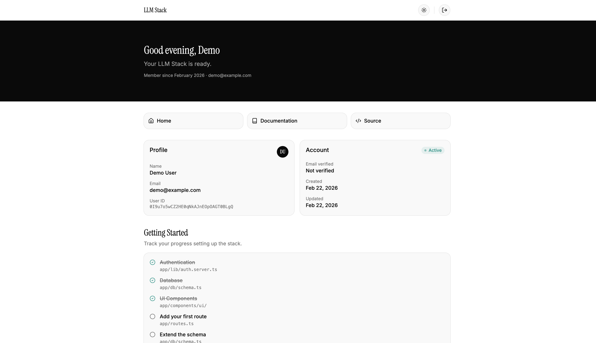
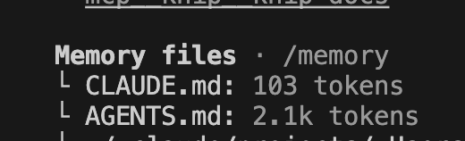
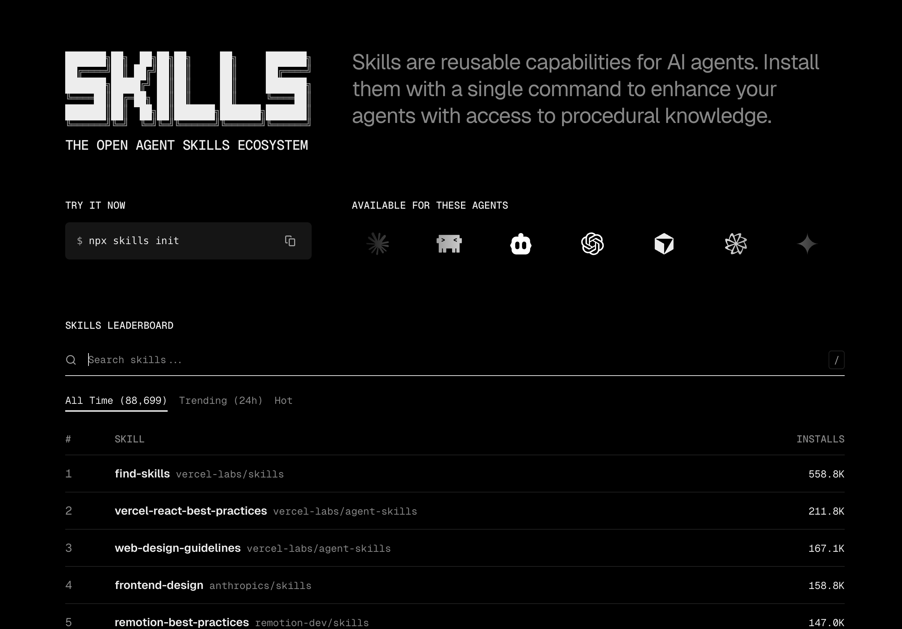

import Alert from "@/components/Alert.astro";
import NewBadge from "./NewBadge";
import MustTryBadge from "./MustTryBadge";
import RepoCard from "./RepoCard.astro";

Over the past months, Claude Code has become my go-to tool for day-to-day development. Whether I'm building new features, debugging issues, or refactoring existing code, it has genuinely changed the way I work and likely yours as well. Along the way, I've picked up a few tips and tricks that I'd like to share.

## Frontend design

This is probably the area where most people still struggle to get good results, so let's cover it first.

If you've ever asked an AI to build UI, you know the results tend to look... let's say, generic. In my opinion, Claude handles frontend surprisingly well, but the quality depends on the context you give it.

### Let your design system do the work

The best results I've gotten are when the project already has a well-defined design system, e.g. a [Tailwind CSS](https://tailwindcss.com/) config with custom tokens, reusable components, or a library like [shadcn/ui](https://ui.shadcn.com/). Claude picks up your color tokens, component APIs, and layout conventions and applies them consistently. In my experience, you don't even need to reference the design system in your `CLAUDE.md` - just having code that follows it is enough for Claude to learn the style.



Both the dashboard above and the repo card below were entirely one-shotted vibe-coded by Claude following the design system in place.

<RepoCard
  repo="nikolailehbrink/llm-stack"
  title="LLM Stack"
  description="Looking for a good starting point with a design system already in place? LLM Stack is a full-stack starter template optimized for agentic development, with next-gen tooling, polished components, authentication, database, and more."
  demo="https://llm-stack.nikolailehbr.ink"
/>

### The `/frontend-design` skill

For cases where you don't have an existing design system or you're building something from scratch, Claude Code ships with a built-in [`/frontend-design`](https://skills.sh/anthropics/skills/frontend-design) skill. It's specifically designed to produce polished, production-grade interfaces that avoid the generic look.

Just invoke it when asking Claude to build UI:

```
/frontend-design Create a pricing page with three tiers
```

I think it works well for landing pages, standalone components, or prototypes where you need something that looks decent out of the box.

### Telling Claude what NOT to do

Generally, telling an LLM what _not_ to do is seen as bad practice. But for frontend design, it seems like the opposite. Without direction, Claude defaults to the Inter font, purple gradients ([thanks @adamwathan](https://x.com/adamwathan/status/1953510802159219096)) and white backgrounds.  
Anthropic calls this ["distributional convergence"](https://claude.com/blog/improving-frontend-design-through-skills), where the model gravitates toward the most common patterns in its training data.

Telling Claude _"Don't use Inter or system fonts. Avoid purple gradients. Skip card grid layouts."_ forces it away from these defaults and should produce better output.

<Alert type="tip">
  You can try to pair that with a reference style - _"Take inspiration from
  Japanese minimalism"_ or _"Think editorial magazine layout"_. Anthropic covers
  this in detail in their [Prompting for Frontend
  Aesthetics](https://platform.claude.com/cookbook/coding-prompting-for-frontend-aesthetics)
  cookbook.
</Alert>

## Context management

This section might become obsolete in a couple of months for most users, especially with Claude now [defaulting to a million tokens of context](https://claude.com/blog/1m-context-ga) when you use Opus or Sonnet 4.6, but I still keep it in here, because I think context engineering is always a useful skill to have when working with LLMs, and understanding how to manage your context window effectively can still lead to better results and more efficient interactions.

### Check your usage

First of all, you can run `/context` at any point to see how much of your token budget is consumed.


If you have MCP servers installed, you will see that even though you're not actively using those tools, their definitions are still taking up a chunk of your context window. That doesn't mean you shouldn't use them, but it's good to be aware that this is the case.

### Clear between tasks

My probably most used command is `/new` (alias for `/clear`). It wipes the conversational history entirely, so that you can start from scratch with a clean context window. Your `CLAUDE.md` instructions and file access are preserved but the chat history is gone.

### Compact long sessions

If you're deep into a session and don't want to lose the thread, `/compact` offers a middle ground. It summarizes your conversation to free up space. I've found that manually running this at around 70-80% capacity gives better summaries than letting it auto-compact at the limit.

<Alert type="info">
  With `/compact` Claude Code reads through your entire conversation and
  generates a condensed summary, then replaces all prior messages with that
  summary in the session file stored at `~/.claude/projects/`. The original
  messages are still preserved in the session transcript, but Claude only sees
  the summary going forward. Auto-compact triggers the same process
  automatically when you're about to hit the context limit — but at that point
  there's less room for a thorough summary, which is why compacting manually
  earlier tends to work better.
</Alert>

### Recite your objectives

During long sessions, Claude can lose track of the original goal - a phenomenon sometimes called "context drift." The fix is simple: periodically re-state what you're trying to achieve. Something like "Remember, the goal is to refactor the auth middleware to use JWT" is enough to pull Claude back on track. This is especially useful after a `/compact`, where some nuance from earlier in the conversation may have been lost in the summary.

### Context Mode plugin

If you want to take context management to the next level, check out the [Context Mode](https://github.com/mksglu/context-mode) plugin. It solves a fundamental problem: every tool call dumps its raw output into your context window. A single Playwright snapshot costs 56 KB. Twenty GitHub issues cost 59 KB. After 30 minutes, a huge chunk of your context is gone.

Context Mode works by running data-heavy operations in a sandboxed subprocess. The raw data - screenshots, API responses, log files, git history - never enters your context window. Only a compact summary does. In their benchmarks, 315 KB of raw output becomes 5.4 KB - a 98% reduction.

Install it as a Claude Code plugin:

```bash
/plugin marketplace add mksglu/context-mode
/plugin install context-mode@context-mode
```

It also tracks your session state in a local SQLite database, so when the conversation compacts, Claude can pick up exactly where it left off instead of forgetting what files it was editing or what tasks were in progress.

## Parallel development

##

## Useful commands

Claude Code ships with a bunch of built-in slash commands and CLI flags that are easy to overlook. Here are the ones I use the most:

<table>
  <thead>
    <tr>
      <th>Command</th>
      <th>What it does</th>
    </tr>
  </thead>
  <tbody>
    <tr>
      <td>`/batch`</td>
      <td>
        <NewBadge /> Splits a large-scale change across parallel worktrees, each
        opening its own PR 
      </td>
    </tr>
    <tr>
      <td>`/btw`</td>
      <td>
        <NewBadge /> Ask a quick side question without polluting the
        conversation history - runs with full context but no tool access
      </td>
    </tr>
    <tr>
      <td>`/clear`</td>
      <td>
        Wipes conversation history but keeps your `CLAUDE.md` and file access
        intact
      </td>
    </tr>
    <tr>
      <td>`/compact`</td>
      <td>
        Summarizes the conversation to free up context without losing the thread
      </td>
    </tr>
    <tr>
      <td>`/context`</td>
      <td>
        Shows a visual breakdown of your token usage - great for spotting what's
        eating your context 
      </td>
    </tr>
    <tr>
      <td>`/fork`</td>
      <td>
        Creates a copy of the current conversation so you can explore an
        alternative path 
      </td>
    </tr>
    <tr>
      <td>`/insights`</td>
      <td>
        <MustTryBadge /> Generates an HTML report analyzing your usage patterns
        across all sessions. This one is a hidden gem - it breaks down what
        you're doing well, where you're losing time, and gives you concrete
        suggestions to improve. I was genuinely surprised by how much I learned
        about my own workflow  
      </td>
    </tr>
    <tr>
      <td>`/rename`</td>
      <td>
        Names your current session so you can find it later with `/resume`.
        Without an argument it auto-generates a name, but I prefer naming
        sessions manually - the auto-generated names only consider recent
        context and can end up too vague 
      </td>
    </tr>
    <tr>
      <td>`/resume`</td>
      <td>
        Resume a previous session by ID or name, or open an interactive picker
      </td>
    </tr>
    <tr>
      <td>`/review`</td>
      <td>
        <NewBadge /> Runs a code review on the current branch's changes
      </td>
    </tr>
    <tr>
      <td>`/security-review`</td>
      <td>
        <NewBadge /> Analyzes your pending changes for security vulnerabilities
        like injection, auth issues, and data exposure
      </td>
    </tr>
    <tr>
      <td>`/simplify`</td>
      <td>
        <NewBadge /> Reviews your changed code for reuse, quality, and
        efficiency, then fixes what it finds
      </td>
    </tr>
    <tr>
      <td>`/voice`</td>
      <td>
        <NewBadge /> Enables voice mode - hold `Space` to record and dictate
        your prompts instead of typing. You can switch the dictation language in
        `/config`
      </td>
    </tr>
  </tbody>
</table>

<Alert type="tip">
  You can run `/help` at any time to see all available commands, including ones
  from installed plugins and custom skills.
</Alert>

## Setting up your CLAUDE.md

Your `CLAUDE.md` file is a persistent system prompt that survives the `/clear` command. It's the single most effective way to make Claude Code understand your project.

### Start with `/init`

If you don't have a `CLAUDE.md` yet, run `/init` and Claude will analyze your codebase and generate one for you. It picks up your project structure, build commands, linting setup, and conventions automatically. It's a solid starting point that you can then refine over time.

### Keep it lean

Over time, your `CLAUDE.md` becomes a focused set of corrections rather than a bloated knowledge base. Aim for around [200 lines at most](https://code.claude.com/docs/en/memory#my-claude-md-is-too-large).

<Alert type="tip">
  You can use [Mermaid](https://mermaid.js.org/) diagrams instead of prose for
  architecture documentation in your `CLAUDE.md`. LLMs consume diagram syntax
  efficiently while conveying complex architecture in hundreds rather than
  thousands of tokens.
</Alert>

Don't try to document everything. Instead, document what Claude gets wrong. Each time you notice a mistake or an unwanted pattern, add a rule.

```md filename="CLAUDE.md" add={2}
- Do NOT introduce new MUI Joy UI usage where there is already a shadcn alternative
- Install new shadcn components with the `base-ui` variant and not from `radix-ui`
```

### Layer your configuration

Claude Code loads `CLAUDE.md` files from multiple locations, with the most specific taking priority:

- `~/.claude/CLAUDE.md` — global rules across all projects
- `project/CLAUDE.md` — project-specific, shared with your team via git
- `project/apps/frontend/CLAUDE.md` — subproject-specific, ideal for frontend/backend splits

### Reference external docs with `@`

You can pull in other files using the `@path` syntax.

#### Importing AGENTS.md into CLAUDE.md

If you're not only using Claude Code but also other AI coding tools like [Codex](https://github.com/openai/codex) or [Cursor](https://cursor.com/) (which mostly rely on `AGENTS.md`), you can keep all your rules in `AGENTS.md` and just point your `CLAUDE.md` to it:

```md filename="CLAUDE.md"
# CLAUDE.md

All rules and conventions are maintained in `AGENTS.md`.
This file only exists to import those rules into Claude Code's context.

@AGENTS.md
```

This way you maintain a single source of truth that works across all your AI coding tools.

To verify that the referenced files are actually loaded, run `/context` and check the "Memory files" section - you should see both your `CLAUDE.md` and the imported file listed with their token counts:



### Include validation commands

Giving Claude a feedback loop improves the quality of the final result significantly. Instead of writing code and hoping it works, Claude can catch its own mistakes.

```md filename="CLAUDE.md"
## Validation

- Run `npm run typecheck` after editing any `.ts` file
- Run `npm run lint` after modifying components
- Run `npm run test` before considering a task complete
```

## Debugging tips

### Paste screenshots instead of describing bugs

This one surprised me by how effective it is. When you're debugging a UI issue, paste a screenshot directly into Claude Code with `Ctrl+V`. Visual context dramatically improves problem diagnosis - instead of trying to describe "the button is misaligned" or "the modal looks broken," you just show it.

A real example from this project: I noticed that empty lines in code blocks were collapsing to zero height. Instead of explaining the issue, I pasted a screenshot showing the broken rendering. Claude used the Chrome DevTools MCP to inspect the element, saw that the `.line` element had no content and therefore no height, and added a single `min-h-[1lh]` fix:

```css filename="src/styles/global.css" add={2}
.line {
  @apply min-h-[1lh];
}
```

Screenshot in, one-line fix out. I've made it a habit to screenshot first, describe second.

### Use Chrome DevTools MCP for live inspection

The [Chrome DevTools MCP](https://github.com/ChromeDevTools/chrome-devtools-mcp) is a game changer for debugging. It connects Claude directly to your browser, so it can read console errors, inspect the DOM, check network requests, and run Lighthouse audits - all without you copy-pasting anything.

Where it really shines is console errors. You know those runtime errors or warnings that pop up in DevTools while you're developing? Instead of copying the stack trace and pasting it into Claude, you just let the MCP server pick them up automatically. Claude sees the error, traces it back to the source, and fixes it. It turns a multi-step debugging workflow into something that basically happens on its own. It can also run Lighthouse audits and act on the results - things like improving your [LCP](https://web.dev/articles/lcp), fixing accessibility issues, or addressing other [Core Web Vitals](https://web.dev/articles/vitals) flags that Chrome surfaces.

## Permission modes

Most developers don't realize they can stop clicking "Allow" for every single action. Claude Code has a permission system that's worth configuring once.

### Cycle modes on the fly

Press `Shift+Tab` to cycle between three modes during a session:

| Mode          | Behavior                     |
| ------------- | ---------------------------- |
| `default`     | Asks permission on first use |
| `acceptEdits` | Auto-accepts file edits      |
| `plan`        | Read-only, no modifications  |

### Set up allow and deny lists

Instead of granting blanket permissions, configure granular rules in `.claude/settings.json`:

```json filename=".claude/settings.json"
{
  "permissions": {
    "allow": ["Bash(npm run *)", "Bash(git commit *)", "Read(src/**)"],
    "deny": ["Read(.env*)", "Bash(curl *)", "Bash(rm -rf *)"]
  }
}
```

This way, common operations like running scripts or reading source files happen without prompts, while dangerous commands are blocked entirely.

<Alert type="warning">
  Avoid using `--dangerously-skip-permissions` in your regular workflows. Use
  explicit allow lists instead — they give you the same convenience with an
  audit trail.
</Alert>

## Plan mode

One of the most underused features. When you start a session with `claude --permission-mode plan` or switch to it with `Shift+Tab`, Claude can read, search, and analyze your codebase — but it cannot modify any files.

I use this for:

- **Understanding unfamiliar code** before touching it
- **Designing an approach** before implementing it
- **Reviewing architecture** without the risk of accidental changes

The workflow looks like this: start in plan mode, iterate on the strategy with Claude until you're confident, then switch to default mode and execute. Front-loading the thinking dramatically reduces wasted edits and drift.

## Hooks

Hooks are where Claude Code turns into a real workflow engine. They run shell commands at specific lifecycle points — before or after tool execution, when a session starts, or when Claude finishes responding.

<Alert type="tip">
  You can set up hooks interactively by running `/hooks` — no need to edit JSON
  manually.
</Alert>

### Auto-format on every edit

This is the first hook I set up in every project. It runs [Prettier](https://prettier.io/) automatically after Claude edits or creates a file:

```json filename=".claude/settings.json"
{
  "hooks": {
    "PostToolUse": [
      {
        "matcher": "Edit|Write",
        "hooks": [
          {
            "type": "command",
            "command": "jq -r '.tool_input.file_path' | xargs npx prettier --write"
          }
        ]
      }
    ]
  }
}
```

No more formatting inconsistencies. Every file Claude touches comes out clean.

### Auto-verify with a Stop hook

A `Stop` hook runs after Claude finishes responding. Use it to catch type errors automatically:

```json filename=".claude/settings.json"
{
  "hooks": {
    "Stop": [
      {
        "hooks": [
          {
            "type": "command",
            "command": "npx tsc --noEmit 2>&1 | head -20"
          }
        ]
      }
    ]
  }
}
```

If TypeScript errors are detected, Claude sees them in the next turn and can fix them without you having to say anything.

### Protect sensitive files

Block Claude from editing files it shouldn't touch:

```bash filename=".claude/hooks/protect-files.sh"
#!/bin/bash
INPUT=$(cat)
FILE=$(echo "$INPUT" | jq -r '.tool_input.file_path')
[[ "$FILE" == *".env"* || "$FILE" == *"package-lock.json"* ]] && exit 2
exit 0
```

Register it as a `PreToolUse` hook with the matcher `Edit|Write`.

### Desktop notifications

Get notified when Claude needs your input instead of staring at the terminal:

```bash
# macOS
osascript -e 'display notification "Claude Code needs your attention" with title "Claude Code"'
```

Add this as a `Notification` hook and you can context-switch freely while Claude works.

## Session management

Claude Code sessions persist, which means you can pick up exactly where you left off.

- **`claude -c`** — continue your most recent session instantly
- **`claude --resume`** — opens an interactive picker with `P` to preview, `R` to rename, `/` to search
- **`/rename auth-refactor`** — name sessions meaningfully so you can find them later
- **`--fork-session`** — branch a session to explore an alternative approach without losing the original

I name every session that lasts more than a few minutes. It makes resuming work the next day so much easier.

## Subagents

For larger tasks, you can spawn specialized agents that work in parallel or handle specific concerns.

### Built-in agents

Claude Code comes with three built-in agent types:

| Agent             | Model     | Purpose                           |
| ----------------- | --------- | --------------------------------- |
| `Explore`         | Haiku     | Fast, read-only codebase research |
| `Plan`            | Inherited | Architecture and planning         |
| `general-purpose` | Inherited | Full capabilities                 |

### Custom agents

Create your own by adding a `SKILL.md` file:

```yaml filename="~/.claude/agents/security-reviewer/SKILL.md"
---
name: security-reviewer
description: Reviews code for security vulnerabilities
tools: Read, Grep, Glob
model: sonnet
memory: project
---

Review code for OWASP Top 10 vulnerabilities.
Focus on: XSS, injection, authentication flaws, and insecure dependencies.
Provide findings by severity: Critical, Warning, Suggestion.
```

The `memory: project` setting means this agent learns your codebase patterns across sessions. You can also create and manage agents interactively with `/agents`.

## Skills

Skills are reusable instruction sets that you invoke with `/skill-name`. Think of them as saved recipes for common workflows.

```yaml filename=".claude/skills/deploy/SKILL.md"
---
name: deploy
description: Deploy the application to production
argument-hint: [environment]
---

Deploy to $0:

1. Run the full test suite
2. Build the application
3. Push to the deployment target
4. Verify the deployment succeeded
```

Now running `/deploy staging` triggers the full workflow.

<Alert type="tip">
  Skills support dynamic context injection using the `` !`command` `` syntax.
  For example, `` !`git diff --staged` `` runs the command and injects its
  output directly into the prompt.
</Alert>

### Community skills

You don't have to write every skill from scratch. [skills.sh](https://skills.sh/) is a community registry where developers share ready-made skills you can browse and install. It's a great starting point if you want to see what's possible or grab something that fits your workflow without reinventing the wheel.



## CLI over MCP

This one is maybe arguable, but I'd consider reaching for a tool's CLI before installing its MCP server. Here's my reasoning.

### MCP tools consume context passively

Every MCP server you register loads its tool definitions - names, descriptions, parameter schemas - into your context window on every request, even if you never use those tools. Users have reported [setups consuming 55-66k tokens](https://github.com/anthropics/claude-code/issues/3406) just from tool definitions, eating up a third of the available context window. You can see this yourself by running `/context`:


With the latest Claude Code release supporting a million tokens of context, this is less of a dealbreaker than it used to be - you're unlikely to run out of context just from tool definitions. But it still adds up, especially if you're running multiple MCP servers. Less noise in the context means better responses.

### Use a CLI with a dedicated skill

Many tools you'd reach for an MCP server for already have a solid CLI. The [GitHub CLI](https://cli.github.com/), [GitLab CLI](https://gitlab.com/gitlab-org/cli), [Obsidian CLI](https://github.com/Yakitrak/obsidian-cli), [Playwright CLI](https://playwright.dev/docs/test-cli) - these are all purpose-built, well-documented, and don't bloat your context window.

The catch is that LLMs might not be fully trained on every CLI's specific flags and syntax, especially newer ones like Playwright. That's where skills come in. You can write a skill that teaches Claude how to use a CLI correctly, preventing hallucinated commands and wasted tokens.

### Example: Playwright

[Playwright](https://playwright.dev/) is a good example of where CLI beats MCP. The [Playwright MCP](https://github.com/microsoft/playwright-mcp) sends the full page structure (the accessibility tree) to the LLM on every single request. For large pages, that means a massive chunk of your context window gets consumed with every interaction. The Playwright CLI, on the other hand, stores the accessibility tree locally. Claude runs CLI commands against it without ever needing to ingest the entire page. The result is faster responses, lower costs, and no issues with large or complex pages.

Pair it with a skill so Claude knows the available commands:

```yaml filename=".claude/skills/playwright/SKILL.md"
---
name: playwright
description: Use when testing web pages or generating Playwright tests
---

Use the Playwright CLI to interact with web pages.

Available commands:
- `npx playwright test` — run all tests
- `npx playwright test --ui` — open interactive UI mode
- `npx playwright codegen <url>` — generate tests by recording actions
- `npx playwright show-report` — view the HTML test report
```

The general rule: if a tool works well as a CLI, prefer the CLI with a skill over an MCP server - especially for tools that would otherwise stream large amounts of data into your context window.

## MCP servers

The [Model Context Protocol](https://modelcontextprotocol.io/) lets you connect Claude to external services - GitHub, Sentry, Slack, your database, and more. MCP really shines for tools that don't have a good CLI alternative.

### When MCP is the right choice

Some tools genuinely need MCP because there's no CLI equivalent or the CLI can't provide the same level of integration:

- **[Chrome DevTools MCP](https://github.com/ChromeDevTools/chrome-devtools-mcp)** - lets Claude inspect the browser directly: read console logs, inspect network requests, take screenshots, and run Lighthouse audits. There's no CLI that gives you this kind of live browser access.
- **[Linear](https://linear.app/)** - project management tools like Linear don't have a full-featured CLI. With the [Linear MCP](https://github.com/linear/linear-mcp), Claude can create issues, update statuses, and query your backlog directly.
- **[Sentry](https://sentry.io/)** - error tracking dashboards have no CLI equivalent for browsing error details, stack traces, and trends.
- **[Notion](https://notion.so/)** - reading and updating docs, wikis, and databases in Notion only works through its API, which MCP wraps nicely.

The pattern: if a tool is primarily a web app with an API but no CLI, MCP is the way to go.

### Adding MCP servers

Setup is straightforward:

```bash
# Add GitHub integration
claude mcp add --transport http github https://api.githubcopilot.com/mcp/

# Add a database connection
claude mcp add --transport stdio db -- npx -y @bytebase/dbhub --dsn "postgresql://..."

# Add Sentry for error tracking
claude mcp add --transport http sentry https://mcp.sentry.dev/mcp
```

Use `--scope project` to share the configuration with your team via `.mcp.json`, or `--scope user` to keep it personal.

## Git worktrees

For parallel development, Claude Code supports [Git worktrees](https://git-scm.com/docs/git-worktree) natively:

```bash
claude --worktree feature-auth
```

This creates an isolated copy of your repo on a new branch. You can run multiple Claude instances simultaneously — one per feature — without conflicts. Worktrees clean up automatically when you exit, or you can keep them and merge later.

The new `/batch` command uses this internally. When you run something like `/batch migrate src/ from CommonJS to ES modules`, it splits the work across 5-30 parallel worktrees automatically.

## Keyboard shortcuts worth knowing

A few shortcuts I use constantly:

| Shortcut    | What it does                                    |
| ----------- | ----------------------------------------------- |
| `Ctrl+O`    | Show extended thinking (see Claude's reasoning) |
| `Ctrl+R`    | Search command history                          |
| `Ctrl+S`    | Stash current prompt for later                  |
| `Ctrl+G`    | Open prompt in your external editor             |
| `Ctrl+V`    | Paste an image for visual analysis              |
| `Cmd+P`     | Switch between Opus, Sonnet, and Haiku          |
| `Cmd+T`     | Toggle extended thinking on/off                 |
| `Shift+Tab` | Cycle permission modes                          |

You can customize all of these in `~/.claude/keybindings.json`.

## Scripting and CI/CD

Claude Code isn't just interactive — it works in non-interactive mode too, which makes it useful for automation:

```bash
# Print mode — single query, no session
claude -p "Explain the authentication flow in this codebase"

# Structured output for piping
claude -p "List all API endpoints" --output-format json

# Validated JSON output
claude -p "Generate a config" --json-schema '{"type":"object","properties":{"port":{"type":"number"}}}'
```

This opens up workflows like automated code reviews in CI, pre-commit analysis, or generating documentation as part of a build pipeline.

## Quick setup checklist

If you're starting a new project with Claude Code, here's my recommended setup order:

1. Create `.claude/CLAUDE.md` with your project's architecture and validation commands
2. Configure `.claude/settings.json` with permission allow/deny lists
3. Add a `PostToolUse` hook for auto-formatting
4. Add a `Stop` hook for type-checking
5. Connect relevant MCP servers (GitHub, Sentry, database)
6. Create project-specific skills for common workflows
7. Run `/doctor` to verify everything is configured correctly

The 30 minutes you spend on this setup will save you hours every week.

That's all for now! Thanks for reading and I would really appreciate your feedback. If you have your own Claude Code tips or workflows that I didn't cover, I'd love to hear about them in the comments!
