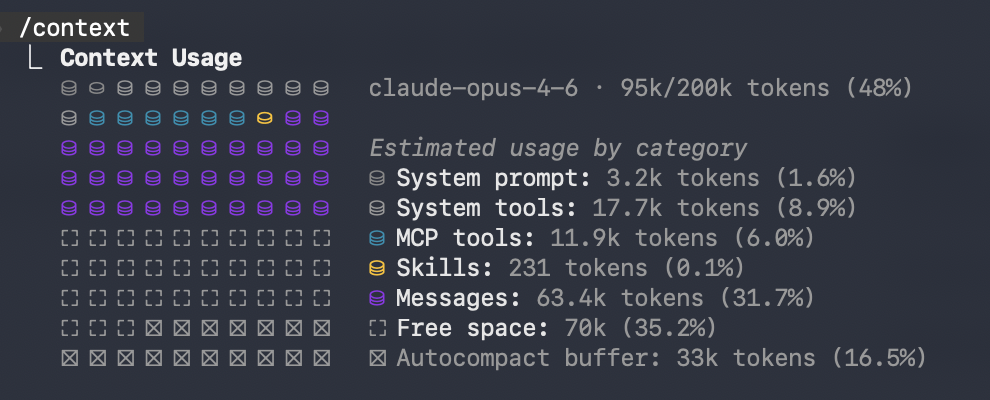

import Alert from "@/components/Alert.astro";
import NewBadge from "./NewBadge";
import MustTryBadge from "./MustTryBadge";

Over the past months, Claude Code has become my go-to tool for day-to-day development. Whether I'm building new features, debugging issues, or refactoring existing code, it has genuinely changed the way I work and likely yours as well. Along the way, I've picked up a few tips and tricks that I'd like to share.

This post covers everything from foundational setup to more advanced workflows like hooks, subagents, and custom skills.

## Frontend design

First let's talk about frontend since that's where probably most people are stuck.

If you've ever asked an AI to build UI by itself, you probably know that the result can feel - lets say ... generic. Claude Code handles frontend work surprisingly well, but the quality depends heavily on the context you give it.

### Let your design system do the work

The best results I've gotten are when the project already has a well-defined design system in place — a [Tailwind CSS](https://tailwindcss.com/) config with custom colors, spacing, and typography, a set of reusable components, or a library like [shadcn/ui](https://ui.shadcn.com/). When Claude sees existing patterns in your codebase, it adapts to them. It picks up your color tokens, your component APIs, your layout conventions, and applies them consistently.

This is where your `CLAUDE.md` can help a lot. Document the design foundations explicitly:

```md filename="CLAUDE.md"
## Design System

- Use Tailwind CSS for all styling
- Colors are defined as CSS variables in `app.css` (e.g. `--color-primary`)
- Use components from `src/components/ui/` (Button, Input, Card, etc.)
- Follow the existing spacing scale, do not use arbitrary values
- Dark mode is supported via the `dark:` variant
```

The more established your design system is, the less Claude has to guess — and the more its output will look like it belongs in your project.

<Alert type="tip">
  If you're starting a new project without a design system, consider using my{" "}
  <a
    href="https://github.com/nikolailehbrink/llm-stack"
    target="_blank"
    rel="noopener"
  >
    LLM Stack
  </a>{" "}
  full-stack starter template, which is optimized for agentic development. It
  gives you a polished set of components, a design system and next-gen tooling,
  handling Authentication, Database, and more.
</Alert>

### The `/frontend-design` skill

For cases where you don't have an existing design system or you're building something from scratch, Claude Code ships with a built-in `/frontend-design` skill. It's specifically designed to produce polished, production-grade interfaces that avoid the typical "AI-generated" look.

Just invoke it when asking Claude to build UI:

```
/frontend-design Create a pricing page with three tiers
```

It works well for landing pages, standalone components, or prototypes where you need something that looks good without setting up a full design system first.

## Useful commands

Claude Code ships with a bunch of built-in slash commands and CLI flags that are easy to overlook. Here are the ones I use the most:

<table>
  <thead>
    <tr>
      <th>Command</th>
      <th>What it does</th>
    </tr>
  </thead>
  <tbody>
    <tr>
      <td>`/batch`</td>
      <td>
        <NewBadge /> Splits a large-scale change across parallel worktrees, each
        opening its own PR 
      </td>
    </tr>
    <tr>
      <td>`/btw`</td>
      <td>
        <NewBadge /> Ask a quick side question without polluting the
        conversation history - runs with full context but no tool access
      </td>
    </tr>
    <tr>
      <td>`/clear`</td>
      <td>
        Wipes conversation history but keeps your `CLAUDE.md` and file access
        intact
      </td>
    </tr>
    <tr>
      <td>`/compact`</td>
      <td>
        Summarizes the conversation to free up context without losing the thread
      </td>
    </tr>
    <tr>
      <td>`/context`</td>
      <td>
        Shows a visual breakdown of your token usage - great for spotting what's
        eating your context 
      </td>
    </tr>
    <tr>
      <td>`/fork`</td>
      <td>
        Creates a copy of the current conversation so you can explore an
        alternative path 
      </td>
    </tr>
    <tr>
      <td>`/insights`</td>
      <td>
        <MustTryBadge /> Generates an HTML report analyzing your usage patterns
        across all sessions. This one is a hidden gem - it breaks down what
        you're doing well, where you're losing time, and gives you concrete
        suggestions to improve. I was genuinely surprised by how much I learned
        about my own workflow  
      </td>
    </tr>
    <tr>
      <td>`/rename`</td>
      <td>
        Names your current session so you can find it later with `/resume`.
        Without an argument it auto-generates a name, but I prefer naming
        sessions manually - the auto-generated names only consider recent
        context and can end up too vague 
      </td>
    </tr>
    <tr>
      <td>`/resume`</td>
      <td>
        Resume a previous session by ID or name, or open an interactive picker
      </td>
    </tr>
    <tr>
      <td>`/review`</td>
      <td>
        <NewBadge /> Runs a code review on the current branch's changes
      </td>
    </tr>
    <tr>
      <td>`/security-review`</td>
      <td>
        <NewBadge /> Analyzes your pending changes for security vulnerabilities
        like injection, auth issues, and data exposure
      </td>
    </tr>
    <tr>
      <td>`/simplify`</td>
      <td>
        <NewBadge /> Reviews your changed code for reuse, quality, and
        efficiency, then fixes what it finds
      </td>
    </tr>
  </tbody>
</table>

<Alert type="tip">
  You can run `/help` at any time to see all available commands, including ones
  from installed plugins and custom skills.
</Alert>

## Context management

Starting with the foundamentals: Your context window is a finite resource. Think of it like RAM — once it's full, performance degrades. Managing it well is probably the single most impactful habit you can build.

### Check your usage

Run `/context` at any point to see how much of your token budget is consumed. You might be surprised how quickly it fills up.



<Alert type="info">

Each [MCP](https://modelcontextprotocol.io/) server's tool definitions consume tokens just by being registered, regardless of whether you actually use them.

</Alert>

### Clear between tasks

The `/clear` command wipes your conversational history entirely. Your `CLAUDE.md` instructions and file access are preserved — only the chat history is gone. I use this between distinct tasks to start fresh.

### Compact long sessions

If you're deep into a session and don't want to lose the thread, `/compact` offers a middle ground. It summarizes your conversation to free up space. I've found that manually running this at around 70-80% capacity gives better summaries than letting it auto-compact at the limit.

<Alert type="info">
  With `/compact` Claude Code reads through your entire conversation and
  generates a condensed summary, then replaces all prior messages with that
  summary in the session file stored at `~/.claude/projects/`. The original
  messages are still preserved in the session transcript, but Claude only sees
  the summary going forward. Auto-compact triggers the same process
  automatically when you're about to hit the context limit — but at that point
  there's less room for a thorough summary, which is why compacting manually
  earlier tends to work better.
</Alert>

## The CLAUDE.md power move

Your `CLAUDE.md` file is a persistent system prompt that survives `/clear`. It's the single most effective way to make Claude Code understand your project.

### Keep it lean

Don't try to document everything. Instead, document what Claude gets wrong. Each time you notice a mistake or an unwanted pattern, add a rule. Over time, your `CLAUDE.md` becomes a focused set of corrections rather than a bloated knowledge base. Aim for around 2,500 tokens at most.

### Layer your configuration

Claude Code loads `CLAUDE.md` files from multiple locations, with the most specific taking priority:

- `~/.claude/CLAUDE.md` — global rules across all projects
- `.claude/CLAUDE.md` — project-specific, shared with your team via git
- Parent directories are also checked, so monorepo setups work naturally

For projects with distinct areas, you can use `.claude/rules/` with path-specific rule files:

```
.claude/rules/
├── frontend/
│   └── RULES.md    # "Use Tailwind CSS, prefer named exports"
└── backend/
    └── RULES.md    # "Use Zod for validation, return proper HTTP status codes"
```

### Include validation commands

This is the tip that had the biggest impact on output quality for me. Tell Claude how to verify its own work:

```md filename="CLAUDE.md"
## Validation

- Run `npm run typecheck` after editing any `.ts` file
- Run `npm run lint` after modifying components
- Run `npm run test` before considering a task complete
```

Giving Claude a feedback loop improves the quality of the final result significantly. Instead of writing code and hoping it works, Claude can catch its own mistakes.

<Alert type="info">
  You can also use [Mermaid](https://mermaid.js.org/) diagrams instead of prose
  for architecture documentation in your `CLAUDE.md`. LLMs consume diagram
  syntax efficiently while conveying complex architecture in hundreds rather
  than thousands of tokens.
</Alert>

## Permission modes

Most developers don't realize they can stop clicking "Allow" for every single action. Claude Code has a permission system that's worth configuring once.

### Cycle modes on the fly

Press `Shift+Tab` to cycle between three modes during a session:

| Mode          | Behavior                     |
| ------------- | ---------------------------- |
| `default`     | Asks permission on first use |
| `acceptEdits` | Auto-accepts file edits      |
| `plan`        | Read-only, no modifications  |

### Set up allow and deny lists

Instead of granting blanket permissions, configure granular rules in `.claude/settings.json`:

```json filename=".claude/settings.json"
{
  "permissions": {
    "allow": ["Bash(npm run *)", "Bash(git commit *)", "Read(src/**)"],
    "deny": ["Read(.env*)", "Bash(curl *)", "Bash(rm -rf *)"]
  }
}
```

This way, common operations like running scripts or reading source files happen without prompts, while dangerous commands are blocked entirely.

<Alert type="warning">
  Avoid using `--dangerously-skip-permissions` in your regular workflows. Use
  explicit allow lists instead — they give you the same convenience with an
  audit trail.
</Alert>

## Plan mode

One of the most underused features. When you start a session with `claude --permission-mode plan` or switch to it with `Shift+Tab`, Claude can read, search, and analyze your codebase — but it cannot modify any files.

I use this for:

- **Understanding unfamiliar code** before touching it
- **Designing an approach** before implementing it
- **Reviewing architecture** without the risk of accidental changes

The workflow looks like this: start in plan mode, iterate on the strategy with Claude until you're confident, then switch to default mode and execute. Front-loading the thinking dramatically reduces wasted edits and drift.

## Hooks

Hooks are where Claude Code turns into a real workflow engine. They run shell commands at specific lifecycle points — before or after tool execution, when a session starts, or when Claude finishes responding.

<Alert type="tip">
  You can set up hooks interactively by running `/hooks` — no need to edit JSON
  manually.
</Alert>

### Auto-format on every edit

This is the first hook I set up in every project. It runs [Prettier](https://prettier.io/) automatically after Claude edits or creates a file:

```json filename=".claude/settings.json"
{
  "hooks": {
    "PostToolUse": [
      {
        "matcher": "Edit|Write",
        "hooks": [
          {
            "type": "command",
            "command": "jq -r '.tool_input.file_path' | xargs npx prettier --write"
          }
        ]
      }
    ]
  }
}
```

No more formatting inconsistencies. Every file Claude touches comes out clean.

### Auto-verify with a Stop hook

A `Stop` hook runs after Claude finishes responding. Use it to catch type errors automatically:

```json filename=".claude/settings.json"
{
  "hooks": {
    "Stop": [
      {
        "hooks": [
          {
            "type": "command",
            "command": "npx tsc --noEmit 2>&1 | head -20"
          }
        ]
      }
    ]
  }
}
```

If TypeScript errors are detected, Claude sees them in the next turn and can fix them without you having to say anything.

### Protect sensitive files

Block Claude from editing files it shouldn't touch:

```bash filename=".claude/hooks/protect-files.sh"
#!/bin/bash
INPUT=$(cat)
FILE=$(echo "$INPUT" | jq -r '.tool_input.file_path')
[[ "$FILE" == *".env"* || "$FILE" == *"package-lock.json"* ]] && exit 2
exit 0
```

Register it as a `PreToolUse` hook with the matcher `Edit|Write`.

### Desktop notifications

Get notified when Claude needs your input instead of staring at the terminal:

```bash
# macOS
osascript -e 'display notification "Claude Code needs your attention" with title "Claude Code"'
```

Add this as a `Notification` hook and you can context-switch freely while Claude works.

## Session management

Claude Code sessions persist, which means you can pick up exactly where you left off.

- **`claude -c`** — continue your most recent session instantly
- **`claude --resume`** — opens an interactive picker with `P` to preview, `R` to rename, `/` to search
- **`/rename auth-refactor`** — name sessions meaningfully so you can find them later
- **`--fork-session`** — branch a session to explore an alternative approach without losing the original

I name every session that lasts more than a few minutes. It makes resuming work the next day so much easier.

## Subagents

For larger tasks, you can spawn specialized agents that work in parallel or handle specific concerns.

### Built-in agents

Claude Code comes with three built-in agent types:

| Agent             | Model     | Purpose                           |
| ----------------- | --------- | --------------------------------- |
| `Explore`         | Haiku     | Fast, read-only codebase research |
| `Plan`            | Inherited | Architecture and planning         |
| `general-purpose` | Inherited | Full capabilities                 |

### Custom agents

Create your own by adding a `SKILL.md` file:

```yaml filename="~/.claude/agents/security-reviewer/SKILL.md"
---
name: security-reviewer
description: Reviews code for security vulnerabilities
tools: Read, Grep, Glob
model: sonnet
memory: project
---

Review code for OWASP Top 10 vulnerabilities.
Focus on: XSS, injection, authentication flaws, and insecure dependencies.
Provide findings by severity: Critical, Warning, Suggestion.
```

The `memory: project` setting means this agent learns your codebase patterns across sessions. You can also create and manage agents interactively with `/agents`.

## Skills

Skills are reusable instruction sets that you invoke with `/skill-name`. Think of them as saved recipes for common workflows.

```yaml filename=".claude/skills/deploy/SKILL.md"
---
name: deploy
description: Deploy the application to production
argument-hint: [environment]
---

Deploy to $0:

1. Run the full test suite
2. Build the application
3. Push to the deployment target
4. Verify the deployment succeeded
```

Now running `/deploy staging` triggers the full workflow.

<Alert type="tip">
  Skills support dynamic context injection using the `` !`command` `` syntax.
  For example, `` !`git diff --staged` `` runs the command and injects its
  output directly into the prompt.
</Alert>

## MCP servers

The [Model Context Protocol](https://modelcontextprotocol.io/) lets you connect Claude to external services — GitHub, Sentry, Slack, your database, and more. It's powerful, but it comes with a cost you should be aware of.

### Mind the context cost

Every MCP server you register loads its tool definitions — names, descriptions, parameter schemas — into your context window on every request, even if you never use those tools. Users have reported [setups consuming 55-66k tokens](https://github.com/anthropics/claude-code/issues/3406) just from tool definitions, eating up a third of the available context window.

Claude Code does have a mitigation for this called **Tool Search**, which automatically kicks in when MCP tool definitions would consume more than 10% of your context. Instead of preloading everything, it lazy-loads tools on demand. But even with Tool Search, it's worth being intentional about which servers you actually need.

### When to prefer CLI over MCP

For some tools, using the CLI directly through a skill produces better results at lower cost. A great example is [Playwright](https://playwright.dev/). The [Playwright MCP](https://github.com/microsoft/playwright-mcp) sends the full page structure (the accessibility tree) to the LLM on every single request. For large pages, that means a massive chunk of your context window gets consumed with every interaction. The [Playwright CLI](https://playwright.dev/docs/test-cli), on the other hand, stores the accessibility tree locally. Claude runs CLI commands against it without ever needing to ingest the entire page. The result is faster responses, lower costs, and no issues with large or complex pages.

The catch is that LLMs may not be trained on every CLI's specific flags and syntax. That's where skills come in. You can write a skill that teaches Claude how to use a CLI correctly, preventing hallucinated commands and wasted tokens:

```yaml filename=".claude/skills/playwright/SKILL.md"
---
name: playwright
description: Use when testing web pages or generating Playwright tests
---

Use the Playwright CLI to interact with web pages.

Available commands:
- `npx playwright test` — run all tests
- `npx playwright test --ui` — open interactive UI mode
- `npx playwright codegen <url>` — generate tests by recording actions
- `npx playwright show-report` — view the HTML test report
```

The general rule: if a tool works well as a CLI and doesn't need to stream large amounts of data into the context window, prefer the CLI with a skill over an MCP server.

### Adding MCP servers

When you do need MCP, setup is straightforward:

```bash
# Add GitHub integration
claude mcp add --transport http github https://api.githubcopilot.com/mcp/

# Add a database connection
claude mcp add --transport stdio db -- npx -y @bytebase/dbhub --dsn "postgresql://..."

# Add Sentry for error tracking
claude mcp add --transport http sentry https://mcp.sentry.dev/mcp
```

Use `--scope project` to share the configuration with your team via `.mcp.json`, or `--scope user` to keep it personal.

## Git worktrees

For parallel development, Claude Code supports [Git worktrees](https://git-scm.com/docs/git-worktree) natively:

```bash
claude --worktree feature-auth
```

This creates an isolated copy of your repo on a new branch. You can run multiple Claude instances simultaneously — one per feature — without conflicts. Worktrees clean up automatically when you exit, or you can keep them and merge later.

The new `/batch` command uses this internally. When you run something like `/batch migrate src/ from CommonJS to ES modules`, it splits the work across 5-30 parallel worktrees automatically.

## Keyboard shortcuts worth knowing

A few shortcuts I use constantly:

| Shortcut    | What it does                                    |
| ----------- | ----------------------------------------------- |
| `Ctrl+O`    | Show extended thinking (see Claude's reasoning) |
| `Ctrl+R`    | Search command history                          |
| `Ctrl+S`    | Stash current prompt for later                  |
| `Ctrl+G`    | Open prompt in your external editor             |
| `Ctrl+V`    | Paste an image for visual analysis              |
| `Cmd+P`     | Switch between Opus, Sonnet, and Haiku          |
| `Cmd+T`     | Toggle extended thinking on/off                 |
| `Shift+Tab` | Cycle permission modes                          |

You can customize all of these in `~/.claude/keybindings.json`.

## Scripting and CI/CD

Claude Code isn't just interactive — it works in non-interactive mode too, which makes it useful for automation:

```bash
# Print mode — single query, no session
claude -p "Explain the authentication flow in this codebase"

# Structured output for piping
claude -p "List all API endpoints" --output-format json

# Validated JSON output
claude -p "Generate a config" --json-schema '{"type":"object","properties":{"port":{"type":"number"}}}'
```

This opens up workflows like automated code reviews in CI, pre-commit analysis, or generating documentation as part of a build pipeline.

## Quick setup checklist

If you're starting a new project with Claude Code, here's my recommended setup order:

1. Create `.claude/CLAUDE.md` with your project's architecture and validation commands
2. Configure `.claude/settings.json` with permission allow/deny lists
3. Add a `PostToolUse` hook for auto-formatting
4. Add a `Stop` hook for type-checking
5. Connect relevant MCP servers (GitHub, Sentry, database)
6. Create project-specific skills for common workflows
7. Run `/doctor` to verify everything is configured correctly

The 30 minutes you spend on this setup will save you hours every week.

That's all for now! Thanks for reading and I would really appreciate your feedback. If you have your own Claude Code tips or workflows that I didn't cover, I'd love to hear about them in the comments!
