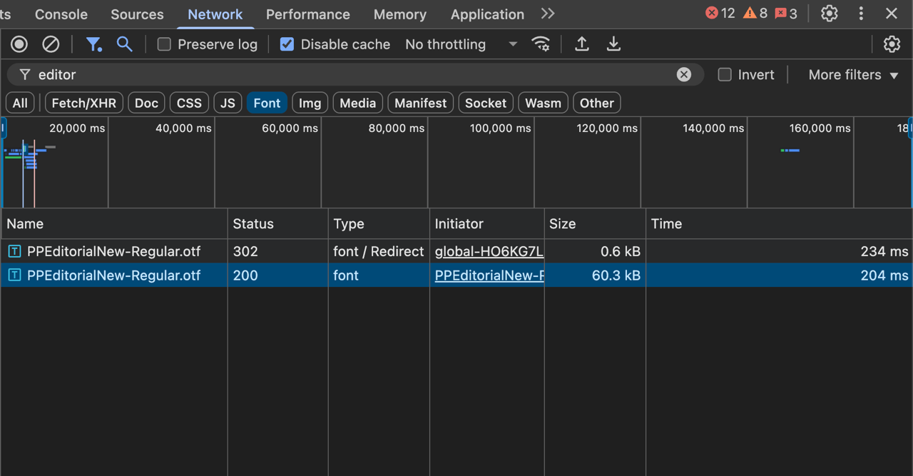

import Alert from "@/components/Alert.astro";
import NewsletterForm from "@/components/react/NewsletterForm";

One of my first tasks at my current job was to review [Web Vitals](https://web.dev/articles/vitals) optimizations made by a colleague. Everything looked fine at first, but when I [inspected asset loading in the network tab](https://developer.chrome.com/docs/devtools/network), I noticed that we were loading an OTF font file even though we had the more efficient WOFF2 version available.

That OTF file was **1.62x** larger than its WOFF2 counterpart.



So what was going on?

## The @font-face declaration

We had a `@font-face{:css}` declaration that loaded our fonts like this:

```css filename="styles.css" highlight={4,5}
@font-face {
  font-family: "PP Editorial New";
  src:
    url("/fonts/PPEditorialNew-Regular.otf") format("opentype"),
    url("/fonts/PPEditorialNew-Regular.eot") format("eot"),
    url("/fonts/PPEditorialNew-Regular.woff2") format("woff2"),
    url("/fonts/PPEditorialNew-Regular.woff") format("woff"),
    url("/fonts/PPEditorialNew-Regular.ttf") format("ttf");
  font-weight: 400;
  font-style: normal;
  font-display: swap;
}
```

At first glance, this seemed fine. But after a bit of digging, I realized the problem wasn't the fonts themselves, but the order in which they were declared.

## How Browsers process font sources

That is because Browsers will download and use the **first font format they can parse**, and **_not_** necessarily **_the best_ or most efficient one**.

In our case, since the OTF was listed first, it was always the one being loaded - even in modern browsers that fully support WOFF2.

<NewsletterForm />

## The solution: Put modern formats first

The solution is pretty straightforward: **list the most modern and efficient formats first**, so that browsers use these first, if they are available.

### Recommended format order

To load fonts efficiently across different browsers, consider this order:

1. **WOFF2** - Most efficient, supported by all modern browsers
2. **WOFF** - Good compression, wider browser support
3. **TTF/OTF** - Fallback for older browsers
4. **EOT** - Only needed for very old versions of Internet Explorer

<Alert type="info">
  WOFF2 offers significantly better compression (up to 30-50% smaller files)
  than WOFF, using the advanced Brotli compression algorithm.
</Alert>

Going back to the previous example, here's the corrected version of our `@font-face` declaration:

```css filename="styles.css" highlight={4,5}
@font-face {
  font-family: "PP Editorial New";
  src:
    url("/fonts/PPEditorialNew-Regular.woff2") format("woff2"),
    url("/fonts/PPEditorialNew-Regular.woff") format("woff"),
    url("/fonts/PPEditorialNew-Regular.ttf") format("ttf"),
    url("/fonts/PPEditorialNew-Regular.otf") format("opentype"),
    url("/fonts/PPEditorialNew-Regular.eot") format("eot");
  font-weight: 400;
  font-style: normal;
  font-display: swap;
}
```

After making this change, I verified the fix by checking the network tab again and the browser now loaded the WOFF2 file instead of the OTF, which saved us and the user **23.1 kB of bandwidth** per font load.


