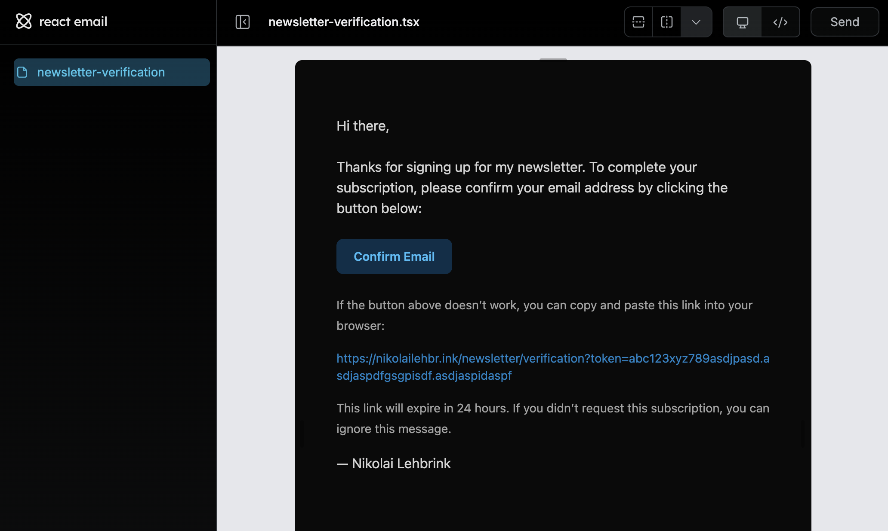

import Video from "@/components/Video.astro";

A newsletter is a powerful way to build and engage with your audience.

In this tutorial, I'll walk through how I created an opt-in newsletter for this website using [Resend](https://resend.com/) for email delivery and [React Email](https://react.email/) for building the verification email template.

I am using [React Router 7 (Framework Mode)](https://reactrouter.com/) for this example but each step can be adapted to your preferred setup.

## The signup flow

<Video
  playbackId="SQzyrwiRKU9iobS2GaPEEZ5By00ccioVo28TLN1rinKc"
  title="Signup flow for newsletter using Resend and React Email"
/>

Here is how a user subscribes to the newsletter:

1. User fills out and submits the sign-up form
2. A double opt-in verification email is sent to the user's email address
3. User clicks the verification link from the email
4. User is now subscribed to the newsletter and redirected to a confirmation page

## Setting up Resend

Resend is a developer-friendly email service that makes it easy to send transactional and marketing emails.

To get started, [sign up for a Resend account](https://resend.com/signup) and obtain your API key.

Next, install the [Resend SDK](https://resend.com/docs/sdks) in your project:

```bash
pnpm install resend
```

## Creating the newsletter sign-up form

## Creating the verification email template

First, install React Email and its components in your project:

```bash
pnpm add react-email -D -E
pnpm add @react-email/components -E
```

Next, create a new file for your email template, e.g., `VerificationEmail.tsx`:

```tsx showLineNumbers filename="src/emails/VerificationEmail.tsx"
import {
  Body,
  Button,
  Container,
  Head,
  Html,
  Preview,
  Section,
  Text,
  Tailwind,
} from "@react-email/components";

type NewsletterVerificationProps = {
  confirmationLink: string;
};

export function PlainText({ confirmationLink }: NewsletterVerificationProps) {
  return `Hi there,
Thanks for signing up for my newsletter.
Please confirm your subscription by clicking the link below:
${confirmationLink}
This link expires in 24 hours. If you didn’t request this, you can ignore this email.
— Nikolai Lehbrink`;
}

const NewsletterVerificationEmail = ({
  confirmationLink,
}: NewsletterVerificationProps) => {
  return (
    <Html lang="en" dir="ltr">
      <Tailwind>
        <Head />
        <Preview>
          Please confirm your email to complete your newsletter subscription
        </Preview>
        <Body className="bg-neutral-950 font-sans text-neutral-300">
          <Container className="mx-auto max-w-[600px] rounded-[8px] bg-neutral-900 p-[40px] shadow-sm">
            <Section>
              <Text className="mb-[24px] text-[16px] leading-[24px]">
                Hi there,
              </Text>

              <Text className="mb-[24px] text-[16px] leading-[24px]">
                Thanks for signing up for my newsletter. To complete your
                subscription, please confirm your email address by clicking the
                button below:
              </Text>

              <Section className="mb-[24px]">
                <Button
                  href={confirmationLink}
                  className="rounded-lg bg-sky-950 px-5 py-3 text-center text-[14px] font-semibold text-sky-400 no-underline hover:bg-sky-600 hover:text-sky-50"
                >
                  Confirm Email
                </Button>
              </Section>

              <Text className="mb-[12px] text-[14px] leading-[20px] text-neutral-400">
                If the button above doesn’t work, you can copy and paste this
                link into your browser:
              </Text>

              <Text
                className="mb-[12px] text-[14px] leading-[20px] text-sky-600"
                style={{
                  wordBreak: "break-all",
                  overflowWrap: "break-word",
                  wordWrap: "break-word",
                }}
              >
                {confirmationLink}
              </Text>

              <Text className="mb-[12px] text-[14px] leading-[20px] text-neutral-400">
                This link will expire in 24 hours. If you didn’t request this
                subscription, you can ignore this message.
              </Text>

              <Text className="mb-[8px] text-[16px] leading-[24px] text-neutral-300">
                — Nikolai Lehbrink
              </Text>
            </Section>
          </Container>
        </Body>
      </Tailwind>
    </Html>
  );
};

NewsletterVerificationEmail.PreviewProps = {
  confirmationLink:
    "https://nikolailehbr.ink/newsletter/verification?token=abc123xyz789asdjpasd.asdjaspdfgsgpisdf.asdjaspidaspf",
} satisfies NewsletterVerificationProps;

export default NewsletterVerificationEmail;
```

This will create a visually appealing verification email using Tailwind CSS styles.


