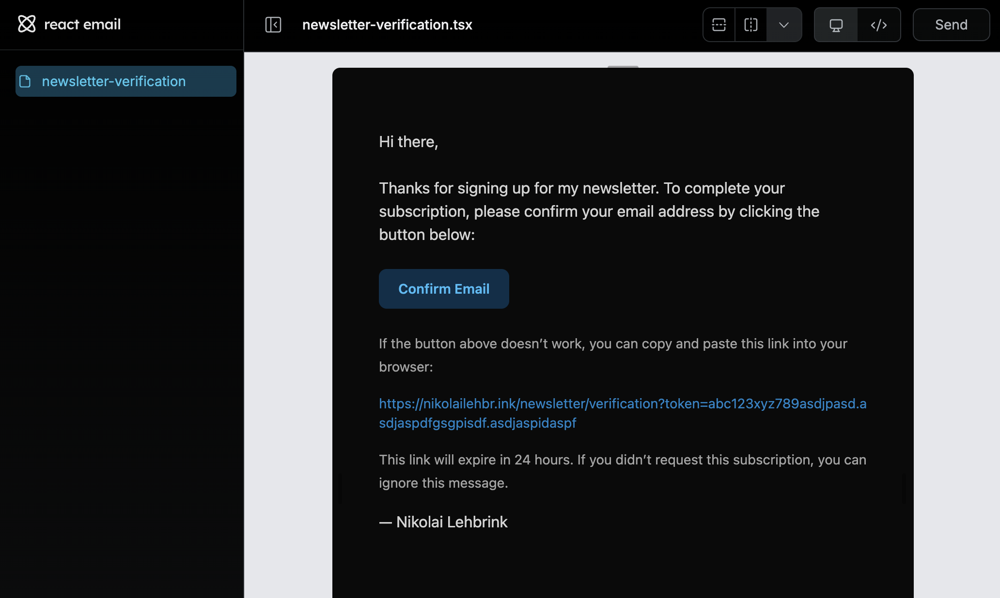

import Video from "@/components/Video.astro";
import Alert from "@/components/Alert.astro";
import NewsletterForm from "@/components/react/NewsletterForm";
import ProfileBadge from "@/components/ProfileBadge.astro";

A newsletter is a powerful way to build and engage with your audience.

In this tutorial, I'll walk through how I created an opt-in newsletter for this website using [Resend](https://resend.com/) for email delivery and [React Email](https://react.email/) for building the verification email template.

I'm using [Astro](https://astro.build/) with React components for this example, but each step can be adapted to your preferred framework.

## The signup flow

<Video
  playbackId="SQzyrwiRKU9iobS2GaPEEZ5By00ccioVo28TLN1rinKc"
  title="Signup flow for newsletter using Resend and React Email"
/>

Here is how a user subscribes to the newsletter:

1. User fills out and submits the sign-up form
2. A double opt-in verification email is sent to the user's email address
3. User clicks the verification link from the email
4. User is now subscribed to the newsletter and redirected to a confirmation page

This double opt-in flow is required for GDPR compliance - you can't just add someone to your mailing list without explicit confirmation.

## Setting up Resend

Resend is a developer-friendly email service that makes it easy to send transactional and marketing emails.

To get started, [sign up for a Resend account](https://resend.com/signup) and obtain your API key.

Next, install the [Resend SDK](https://resend.com/docs/sdks) in your project:

```bash
pnpm install resend
```

Then, initialize the Resend client with your API key:

```ts filename="src/lib/resend.ts"
import { Resend } from "resend";

export const resend = new Resend(import.meta.env.RESEND_API_KEY);
```

Make sure to add `RESEND_API_KEY` to your environment variables. You'll also want to create an [Audience](https://resend.com/docs/dashboard/audiences/introduction) in the Resend dashboard - this is where your subscribers will be stored.

### Creating a signed token utility

Before we build the form, we need a way to generate secure verification links. I'm using HMAC-signed tokens with a 24-hour expiration instead of storing tokens in a database:

```ts showLineNumbers filename="src/lib/token.ts"
import { createHmac } from "crypto";

const NEWSLETTER_SECRET = import.meta.env.NEWSLETTER_SECRET;

function createHmacSignature(payload: string): string {
  if (!NEWSLETTER_SECRET) {
    throw new Error("Token secret is not defined");
  }
  return createHmac("sha256", NEWSLETTER_SECRET)
    .update(payload)
    .digest("base64url");
}

export function createSignedToken(email: string, expiresInSeconds = 86400) {
  const expiresAt = Math.floor(Date.now() / 1000) + expiresInSeconds;
  const payload = `${email}.${expiresAt}`;
  const signature = createHmacSignature(payload);
  const emailEncoded = Buffer.from(email).toString("base64url");

  return `${emailEncoded}.${signature}.${expiresAt}`;
}

export function verifySignedToken(token: string): string | null {
  try {
    const [emailEncoded, signature, expiresAtStr] = token.split(".");
    if (!emailEncoded || !signature || !expiresAtStr) {
      return null;
    }

    const email = Buffer.from(emailEncoded, "base64url").toString("utf8");
    const expiresAt = parseInt(expiresAtStr, 10);
    if (Date.now() / 1000 > expiresAt) {
      return null;
    }

    const payload = `${email}.${expiresAt}`;
    const expectedSig = createHmacSignature(payload);

    if (expectedSig !== signature) {
      return null;
    }
    return email;
  } catch (error) {
    console.error("Error verifying token:", error);
    return null;
  }
}
```

The token format is `base64url(email).hmacSignature.expiresAt`. When a user clicks the verification link, we decode the email, check the expiration, and verify the HMAC signature - no database required.

<Alert type="tip" title="Why not JWT?">
  JWTs work fine here too, but a simple HMAC token is lighter and we don't need
  any of JWT's extra features like headers or standardized claims. The token
  only needs to carry an email and an expiration.
</Alert>

Add a `NEWSLETTER_SECRET` to your environment variables - this should be a long, random string.

## Creating the newsletter sign-up form

### Form validation schema

First, let's define the validation schema using [Zod](https://zod.dev/). The `company` field is a honeypot - it's hidden from real users but bots will fill it in, giving us a simple spam filter:

```ts filename="src/lib/definitions.ts"
import { coerceFormValue } from "@conform-to/zod/v4/future";
import z from "zod";

export const newsletterFormSchema = coerceFormValue(
  z.object({
    email: z.email("Please enter a valid email address."),
    company: z.string().optional(),
  }),
);
```

I'm using [Conform](https://conform.guide/) with Zod for form validation - it gives you progressive enhancement and works great with server actions.

### The form component

The form itself is a React component that uses Astro's [server actions](https://docs.astro.build/en/guides/actions/) under the hood:

```tsx showLineNumbers filename="src/components/react/NewsletterForm.tsx"
import { getInputProps } from "@conform-to/react";
import { useForm } from "@conform-to/react/future";
import { getZodConstraint } from "@conform-to/zod/v4/future";
import { Label } from "./ui/label";
import { CircleNotchIcon } from "@phosphor-icons/react/dist/ssr/CircleNotch";
import { EnvelopeIcon } from "@phosphor-icons/react/dist/ssr/Envelope";
import { Input } from "./ui/input";
import { Button } from "./ui/button";
import { cn } from "@/lib/utils";
import FormMessage from "./FormMessage";
import FormItem from "./FormItem";
import { newsletterFormSchema } from "@/lib/definitions";
import { actions } from "astro:actions";
import { useActionState } from "react";
import { withState } from "@astrojs/react/actions";

export default function NewsletterForm({
  showText = true,
  className,
  ...props
}: React.ComponentProps<"form"> & {
  showText?: boolean;
}) {
  const [state, action, isPending] = useActionState(
    withState(actions.newsletter),
    null,
  );
  const { form, fields } = useForm({
    lastResult: state?.data?.result,
    constraint: getZodConstraint(newsletterFormSchema),
    shouldValidate: "onBlur",
    shouldRevalidate: "onInput",
    schema: newsletterFormSchema,
  });

  const sendSuccessfully = state?.data?.success;

  return (
    <form
      method="POST"
      className={cn(
        `not-prose inline-grid w-full grid-cols-1 gap-2 rounded-xl border bg-linear-to-b from-card to-card p-4 offset-border @lg:grid-cols-2`,
        className,
      )}
      {...props}
      {...form.props}
      action={action}
    >
      {showText ? (
        <>
          <p className="text-lg font-bold text-foreground">
            A little note from me
          </p>
          <p className="mb-2 text-sm text-muted-foreground">
            I put a lot of effort into creating content that is informative,
            engaging, and useful for my readers. If you find it valuable, please
            consider subscribing to my newsletter.
          </p>
        </>
      ) : null}

      {/* Honeypot field - hidden from real users */}
      <div className="group/form-item hidden flex-col gap-2">
        <label>
          Company
          <input
            type="text"
            name="company"
            autoComplete="one-time-code"
            tabIndex={-1}
          />
        </label>
      </div>

      <FormItem>
        <Label className="sr-only" htmlFor={fields.email.id}>
          Email
        </Label>
        <div className="flex gap-2 max-sm:flex-col">
          <Input
            {...getInputProps(fields.email, { type: "email" })}
            placeholder="Enter your email"
          />
          <Button type="submit" disabled={isPending}>
            {isPending ? (
              <>
                Sending
                <CircleNotchIcon
                  className="animate-spin"
                  weight="duotone"
                  size={20}
                />
              </>
            ) : (
              <>
                Join newsletter
                <EnvelopeIcon weight="duotone" size={20} />
              </>
            )}
          </Button>
        </div>
        <FormMessage id={fields.email.errorId}>
          {fields.email.errors}
        </FormMessage>
      </FormItem>
      {form.errors && form.errors.length > 0 ? (
        <FormMessage
          className="col-span-full items-start rounded-md border border-red-200 bg-red-50 p-2 dark:border-red-900 dark:bg-red-950"
          iconSize={20}
        >
          {form.errors.map((error, index) => (
            <span key={index}>{error}</span>
          ))}
        </FormMessage>
      ) : null}
      {sendSuccessfully && (
        <FormMessage
          className="col-span-full items-start rounded-md border border-sky-200 bg-sky-50 p-2 text-sky-600 dark:border-sky-900 dark:bg-sky-950 dark:text-sky-400"
          icon={EnvelopeIcon}
          iconSize={20}
        >
          <p>
            <strong>Almost there!</strong> Look for a verification email in your
            inbox - and don't forget to check your <i>spam folder</i>.
          </p>
        </FormMessage>
      )}
    </form>
  );
}
```

A few things to note here:

- `useActionState` from React 19 paired with Astro's `withState` gives us a clean way to handle form submissions with loading states
- Conform handles both client-side and server-side validation seamlessly
- The honeypot _"company"_ field is hidden with `className="hidden"` and uses `tabIndex={-1}` so keyboard navigation skips it

<NewsletterForm client:load />

## Handling the form submission

The server action is where the main logic lives. It validates the form data, checks for spam, looks up existing subscribers, creates a signed token, and sends the verification email:

```ts showLineNumbers filename="src/actions/index.ts"
import { newsletterFormSchema } from "@/lib/definitions";
import { resend } from "@/lib/resend";
import { createSignedToken } from "@/lib/token";
import { parseSubmission, report } from "@conform-to/react/future";
import { track } from "@vercel/analytics/server";
import { defineAction } from "astro:actions";
import NewsletterVerificationEmail, {
  PlainText,
} from "@/components/react/emails/newsletter-verification";
import { RESEND_NEWSLETTER_AUDIENCE_ID } from "@/consts";

export const server = {
  newsletter: defineAction({
    accept: "form",
    handler: async (formData, ctx) => {
      const {
        request: { headers, url },
      } = ctx;
      const { origin } = new URL(url);

      const submission = parseSubmission(formData);
      const result = newsletterFormSchema.safeParse(submission.payload);

      if (!result.success) {
        return {
          result: report(submission, {
            error: { issues: result.error.issues },
          }),
        };
      }

      const { email, company: honeypot } = result.data;

      // If the honeypot field is filled, a bot submitted the form
      if (honeypot !== undefined) {
        await track("honeypot-triggered", {
          form: "newsletter-signup",
          input: honeypot,
        });
        // Return success to not reveal the honeypot
        return { result: report(submission) };
      }

      // Check if the user is already subscribed
      const { data: contact } = await resend.contacts.get({
        email,
        audienceId: RESEND_NEWSLETTER_AUDIENCE_ID,
      });

      if (contact) {
        return {
          result: report(submission, {
            error: {
              formErrors: ["You are already subscribed to the newsletter."],
            },
          }),
        };
      }

      // Create signed verification token and link
      const token = createSignedToken(email);
      const confirmationLink = `${origin}/api/newsletter/verification?token=${token}`;

      // Send the verification email
      const { error } = await resend.emails.send({
        from: "Nikolai Lehbrink <mail@nikolailehbr.ink>",
        to: [import.meta.env.DEV ? "delivered@resend.dev" : email],
        subject: "Confirm your newsletter subscription",
        tags: [{ name: "category", value: "newsletter-form" }],
        text: PlainText({ confirmationLink }),
        react: NewsletterVerificationEmail({ confirmationLink }),
      });

      if (error) {
        console.error("Error sending confirmation email:", error);
        return {
          result: report(submission, {
            error: {
              formErrors: [
                "There was an error sending the confirmation email. Please try again later.",
              ],
            },
          }),
        };
      }

      return { result: report(submission), success: true };
    },
  }),
};
```

Let's break down the key parts:

1. **Validation** - The form data is parsed and validated against the Zod schema
2. **Honeypot check** - If a bot filled in the hidden _"company"_ field, we silently accept the submission (returning success so the bot doesn't know it was caught)
3. **Duplicate check** - We query the Resend audience to see if the email is already subscribed
4. **Token generation** - A signed token is created containing the email and expiration
5. **Email sending** - Both HTML and plain text versions are sent via Resend

<Alert type="info">
  In development mode, emails are sent to `delivered@resend.dev` instead of the
  actual email address. This is a [Resend testing
  address](https://resend.com/docs/dashboard/emails/send-test-emails) that
  always succeeds without actually delivering anything.
</Alert>

## Creating the verification email template

First, install React Email and its components:

```bash
pnpm add react-email -D -E
pnpm add @react-email/components -E
```

You can also add a script to your `package.json` to preview your emails locally:

```json filename="package.json"
{
  "scripts": {
    "dev:email": "email dev --dir src/components/react/emails"
  }
}
```

Running `pnpm dev:email` starts a local dev server where you can preview and iterate on your email templates - it's a huge time saver compared to testing emails by actually sending them.

Now create the email template. I'm including both an HTML version (using React Email components with Tailwind) and a plain text fallback:

```tsx showLineNumbers filename="src/components/react/emails/newsletter-verification.tsx"
import {
  Body,
  Button,
  Container,
  Head,
  Html,
  Preview,
  Section,
  Text,
  Tailwind,
} from "@react-email/components";

type NewsletterVerificationProps = {
  confirmationLink: string;
};

export function PlainText({ confirmationLink }: NewsletterVerificationProps) {
  return `Hi there,
Thanks for signing up for my newsletter.
Please confirm your subscription by clicking the link below:
${confirmationLink}
This link expires in 24 hours. If you didn't request this, you can ignore this email.
— Nikolai Lehbrink`;
}

const NewsletterVerificationEmail = ({
  confirmationLink,
}: NewsletterVerificationProps) => {
  return (
    <Html lang="en" dir="ltr">
      <Tailwind>
        <Head />
        <Preview>
          Please confirm your email to complete your newsletter subscription
        </Preview>
        <Body className="bg-neutral-950 font-sans text-neutral-300">
          <Container className="mx-auto max-w-[600px] rounded-[8px] bg-neutral-900 p-[40px] shadow-sm">
            <Section>
              <Text className="mb-[24px] text-[16px] leading-[24px]">
                Hi there,
              </Text>

              <Text className="mb-[24px] text-[16px] leading-[24px]">
                Thanks for signing up for my newsletter. To complete your
                subscription, please confirm your email address by clicking the
                button below:
              </Text>

              <Section className="mb-[24px]">
                <Button
                  href={confirmationLink}
                  className="rounded-lg bg-sky-950 px-5 py-3 text-center text-[14px] font-semibold text-sky-400 no-underline"
                >
                  Confirm Email
                </Button>
              </Section>

              <Text className="mb-[12px] text-[14px] leading-[20px] text-neutral-400">
                If the button above doesn't work, you can copy and paste this
                link into your browser:
              </Text>

              <Text
                className="mb-[12px] text-[14px] leading-[20px] text-sky-600"
                style={{ wordBreak: "break-all" }}
              >
                {confirmationLink}
              </Text>

              <Text className="mb-[12px] text-[14px] leading-[20px] text-neutral-400">
                This link will expire in 24 hours. If you didn't request this
                subscription, you can ignore this message.
              </Text>

              <Text className="mb-[8px] text-[16px] leading-[24px] text-neutral-300">
                — Nikolai Lehbrink
              </Text>
            </Section>
          </Container>
        </Body>
      </Tailwind>
    </Html>
  );
};

NewsletterVerificationEmail.PreviewProps = {
  confirmationLink:
    "https://nikolailehbr.ink/newsletter/verification?token=abc123xyz789",
} satisfies NewsletterVerificationProps;

export default NewsletterVerificationEmail;
```

This creates a dark-themed verification email that matches the look of the website. The `PreviewProps` at the bottom are used by the React Email dev server for previewing.



<Alert type="tip" title="Always include a plain text version">
  Some email clients don't render HTML, and spam filters look more favorably on
  emails that include both HTML and plain text. The `PlainText` export gives us
  a simple string version that Resend sends alongside the HTML.
</Alert>

## Verifying the subscription

When the user clicks the confirmation link in the email, they hit this API endpoint:

```ts showLineNumbers filename="src/pages/api/newsletter/verification.ts"
import { verifySignedToken } from "@/lib/token";
import { resend } from "@/lib/resend";
import type { APIRoute } from "astro";
import { RESEND_NEWSLETTER_AUDIENCE_ID } from "@/consts";

export const prerender = false;

export const GET: APIRoute = async ({ redirect, url }) => {
  const { searchParams } = url;
  const token = searchParams.get("token");

  if (!token) {
    throw new Error("No token provided");
  }

  const email = verifySignedToken(token);

  if (!email) {
    throw new Error("Wrong token");
  }

  try {
    // Check if the contact already exists
    const { data } = await resend.contacts.get({
      email,
      audienceId: RESEND_NEWSLETTER_AUDIENCE_ID,
    });

    if (data) {
      return redirect("/newsletter/confirmation?alreadySubscribed=true");
    }

    const { error } = await resend.contacts.create({
      email,
      audienceId: RESEND_NEWSLETTER_AUDIENCE_ID,
    });

    if (error) {
      console.error("Error adding contact:", error);
      throw new Error("Error adding contact");
    }
  } catch (error) {
    console.error("Error verifying token:", error);
    throw new Error("Error verifying token");
  }

  return redirect("/newsletter/confirmation");
};
```

The flow is straightforward:

1. Extract the token from the URL query parameter
2. Verify the HMAC signature and check expiration
3. If the contact already exists, redirect with an `alreadySubscribed` flag
4. Otherwise, add the email to the Resend audience and redirect to the confirmation page

### The confirmation page

The confirmation page is a simple Astro page that shows a success message. It also handles the case where someone clicks the verification link again after already subscribing:

```astro filename="src/pages/newsletter/confirmation.astro"
---
import ErrorPageLayout from "@/layouts/ErrorPageLayout.astro";

export const prerender = false;

const { searchParams } = Astro.url;
const alreadySubscribed = searchParams.has("alreadySubscribed");

const title = alreadySubscribed
  ? "You are already subscribed!"
  : "Thank you for subscribing!";

const description = `I promise to only send you relevant updates and content
about once a month. If you ever change your mind, you can unsubscribe at any
time from each email.`;
---

<ErrorPageLayout title={title} description={description} />
```

## Environment variables

To recap, here are all the environment variables you need:

```bash filename=".env"
# Resend API key from https://resend.com/api-keys
RESEND_API_KEY=re_xxxxxxxxxxxxx

# Your Resend audience ID
RESEND_NEWSLETTER_AUDIENCE_ID=xxxxxxxx-xxxx-xxxx-xxxx-xxxxxxxxxxxx

# A long random string for signing verification tokens
NEWSLETTER_SECRET=your-random-secret-here
```

## Wrapping up

That's the full implementation - a GDPR-compliant double opt-in newsletter with spam protection, signed verification tokens, and a clean email template. The key pieces are:

- **Resend** for email delivery and audience management
- **React Email** for building email templates with React and Tailwind
- **HMAC tokens** for stateless, secure verification links
- **Honeypot fields** for simple bot protection without CAPTCHAs

You can find the full source code for this implementation in this site's <ProfileBadge platform="GitHub" handle="nikolailehbrink/portfolio">GitHub repository</ProfileBadge>. If you have any questions, feel free to reach out!
